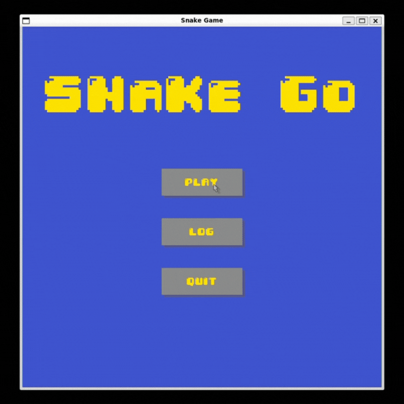

# Snake Game

This project is a C++ implementation of the classic snake game, with enhanced features and user interface. The game allows the user to choose the play mode, pause, resume, and restart the game, and save the top score with the user name. The game also has different kinds of foods with different abilities, such as increasing or decreasing the snake’s speed, size, or score. The game uses the SDL library to render the graphics and handle the user input. The game also uses various C++ features and techniques, such as object-oriented programming, inheritance, polymorphism, smart pointers, move semantics, and multithreading. The game demonstrates the ability to create a complex and interactive C++ application using a wide range of C++ concepts and skills.

## Dependencies for Running Locally
* cmake >= 3.7
  * All OSes: [click here for installation instructions](https://cmake.org/install/)
* make >= 4.1 (Linux, Mac), 3.81 (Windows)
  * Linux: make is installed by default on most Linux distros
  * Mac: [install Xcode command line tools to get make](https://developer.apple.com/xcode/features/)
  * Windows: [Click here for installation instructions](http://gnuwin32.sourceforge.net/packages/make.htm)
* SDL2 >= 2.0, SDL2_image >= 2.0, SDL2_ttf >= 2.0
  * All installation instructions can be found [here](https://wiki.libsdl.org/Installation), [here](https://wiki.libsdl.org/SDL2_image/FrontPage) and [here](https://wiki.libsdl.org/SDL2_ttf/FrontPage)
  >Note that for Linux, an `apt` or `apt-get` installation is preferred to building from source.

* gcc/g++ >= 5.4
  * Linux: gcc / g++ is installed by default on most Linux distros
  * Mac: same deal as make - [install Xcode command line tools](https://developer.apple.com/xcode/features/)
  * Windows: recommend using [MinGW](http://www.mingw.org/)

## Basic Build Instructions

1. Clone this repo.
2. Make a build directory in the top level directory: `mkdir build && cd build`
3. Compile: `cmake .. && make`
4. Run it: `./SnakeGame`.

## Thank

Textures and colors come from my childhood anime [Pokémon](https://wikipedia.org/wiki/Pok%C3%A9mon).  
Font comes from [dafont.com](https://www.dafont.com/04b-30.font).  
Special thanks to [udacity/CppND-Snake-Game](https://github.com/udacity/CppND-Capstone-Snake-Game) for becoming the starter code for this project.

## CC Attribution-ShareAlike 4.0 International

Shield: [![CC BY-SA 4.0][cc-by-sa-shield]][cc-by-sa]

This work is licensed under a
[Creative Commons Attribution-ShareAlike 4.0 International License][cc-by-sa].

[![CC BY-SA 4.0][cc-by-sa-image]][cc-by-sa]

[cc-by-sa]: http://creativecommons.org/licenses/by-sa/4.0/
[cc-by-sa-image]: https://licensebuttons.net/l/by-sa/4.0/88x31.png
[cc-by-sa-shield]: https://img.shields.io/badge/License-CC%20BY--SA%204.0-lightgrey.svg
